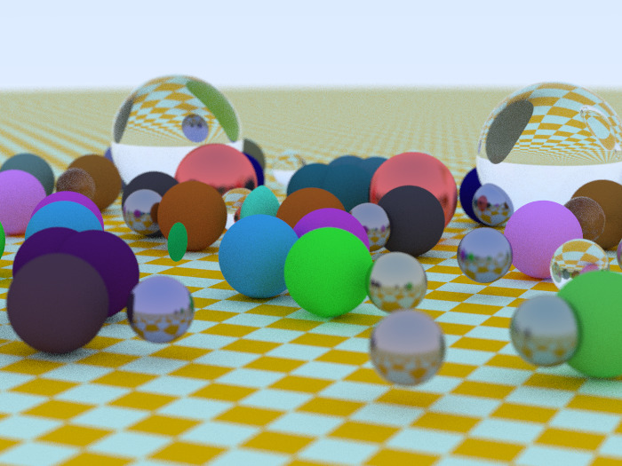

# Ray Tracing
## Introduction
This project is a ray-tracer written in python.
## Features
- Positionable camera
- Spheres
- Diffuse material
- Metal material
- Dielectrics
- Instances
- Bounding Volume Hierarchy
- Plane
- Shadows
## Build
Since this project is in python, it does not need to compile or build anything.
## Run
- Download zipped folder
- Unzip and extract all
- Open Command Prompt(Windows) or Terminal(Mac), go to the directory of codes
- Run the following command
```
python main.py > image.ppm
```
and it would render an image of 700x525 with 100 samples per pixel saved as "image.ppm".

You can view the image using on website "https://www.cs.rhodes.edu/welshc/COMP141_F16/ppmReader.html"
or convert it using image converter online.
## Final Image


It takes around 4 hours to render the final image with 100 samples per pixel.